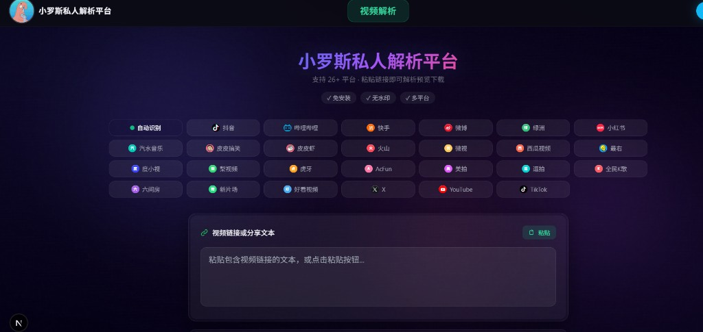

# 小罗斯私人解析平台

基于 [wu529778790/parse.shenzjd.com](https://github.com/wu529778790/parse.shenzjd.com) **二改**的私人短视频解析站点。

> **原作者 / Upstream**：[@wu529778790](https://github.com/wu529778790) · [parse.shenzjd.com](https://github.com/wu529778790/parse.shenzjd.com)  
> 本仓库为个人二次修改版，致谢原项目开源。



## 本仓库相对原版的改动

- 品牌改为「小罗斯私人解析平台」，自定义头像 / 赞赏码
- 去掉微信公众号关注验证码门槛
- 去掉原站顶栏多导航、登录、右侧公众号浮窗及法律页脚
- 精简顶栏：视频解析居中 + QQ「联系我」入口
- 新增**全站访问密码门**（Middleware + Cookie）
- 粘贴 / 解析按钮固定绿色主题

## 功能

- 支持抖音、B站、小红书、快手等 **26+** 平台链接解析
- 粘贴分享文案自动提取链接 → 预览 → 下载
- 访问密码保护（适合私人部署）

## 本地运行

```bash
npm install
cp .env.example .env.local   # Windows 可手动复制
# 编辑 .env.local：SITE_PASSWORD、AUTH_SECRET
npm run dev
```

打开 http://localhost:3000 ，输入 `SITE_PASSWORD` 后进入。

### 环境变量

| 变量 | 必填 | 说明 |
|------|------|------|
| `SITE_PASSWORD` | 是 | 网站访问密码 |
| `AUTH_SECRET` | 是 | Cookie 签名密钥（长随机串） |
| `DOUYIN_COOKIE` | 否 | 提高抖音解析成功率 |
| `BILIBILI_COOKIE` | 否 | 提高 B站解析成功率 |

## 部署（推荐 Cloudflare Workers）

原项目已适配 OpenNext，国内访问通常优于 Vercel。

1. Fork / 推送本仓库到 GitHub  
2. Cloudflare Dashboard → **Workers & Pages** → Import 本仓库  
3. **Build command**：`npm run build:cf`  
4. **Deploy command**：`npx wrangler deploy`  
5. Secrets 中配置 `SITE_PASSWORD`、`AUTH_SECRET`（以及可选 Cookie）  
6. Redeploy

### 备选：Vercel

Import 仓库 → 默认 `npm run build` → 同样配置上述环境变量 → Deploy。

### Docker

```bash
docker build -t qushuiyinpra .
docker run -d -p 3000:3000 \
  -e SITE_PASSWORD=你的密码 \
  -e AUTH_SECRET=随机长字符串 \
  qushuiyinpra
```

## 致谢

- 核心解析与多平台能力来自原项目：[wu529778790/parse.shenzjd.com](https://github.com/wu529778790/parse.shenzjd.com)
- 请遵守各平台服务条款与版权法规；本工具仅供学习与私人自用，勿用于商业或侵权用途。

## 许可证

沿用原项目 **MIT License**。二改部分同样以 MIT 开源；使用请保留对原作者的致谢说明。
